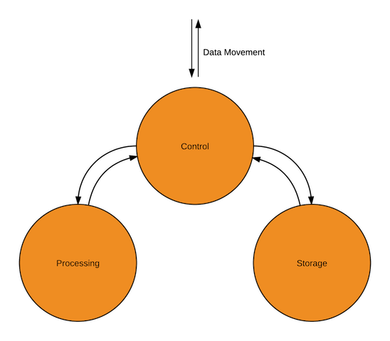
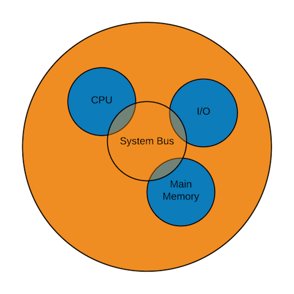
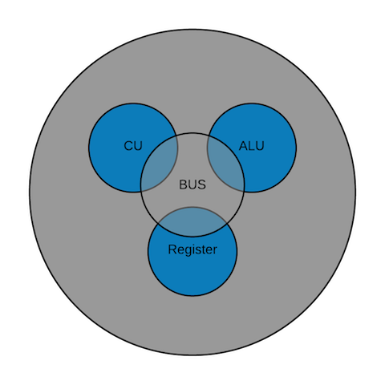

# Intro to Computer Architecture and Org/Struct and Function - 3/28/16

### Computer Organization vs Computer Architecture

###### Computer Organization

 - Organization refers to the _Actual_ physical component of the system
 - Implementation of hardware details and how they interact with each other
 - These attributes are transparent to the programmer
 - Ex: **Control Signal** and **Memory System**

###### Computer Architecture
 - Atrributes that have direct impact to program.
 - Attributes are visible to the programmer.
 - Ex: ISA (Instruction Set Architecture)
 - Ex: The number of bits used to represent different data types 
 - Ex: Addressing Mode TEchniques
 - Ex: Registers

###### Mulitiply Instruction
 - It multiplies.
 - Architectual decision.
 - Implementation => Organizational Decision
   - Repeated Addition
   - Multiplier Unit

### Structure and Function

###### The Computer is a Complex System
 - **Structure** (components and subcomponents and how they interact with each other)
   - Top - level view
 - **Function** (how each of these components operate)

### Four Basic Functions of the Systems

 1. Data Storage
   - Short term storage
   - Long term storage
 2. Data Processing
 3. Data Movement
   - Computer is used as a source and destination
   - If the device is connected to the system directly, the preocess is called input/output and the device is referred to as peripherals
   - If the device is remote over longer distance the process is referred to as communication.
 4. Control

 

### Structure of the System

###### Structure of the Computer
 - CPU => Central Processing Unit
   - Instruction fetch
   - Decoding
   - Execution
 - Input/Output
   - **Moves** data into the system and out
 - Main Memory
   - Provides storage for system
   - Also known as **RAM**
 - System Bus
   - Comimages:
	cpu-view.png
	system-view.png
	top-level-view.png
munication between previous 3
   - Makes it possible for cpu, memory, and i/o to communicate and exchange information.
   

 
 
###### Components of a CPU
 - Control Unit
   - Provides control the operation of the CPU and hence controlling the entire system
 - Arithmetic Logic Unit
   - Provides data processing function
 - Registers
   - Internal storage for the CPU
   - The more registers, the faster performance and faster CPU
 - Internal Bus
   - Similar to System Bus

 

### Topics for Next Class
 - Multicore processor.
