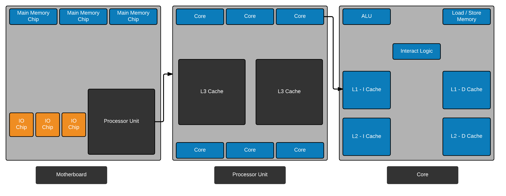
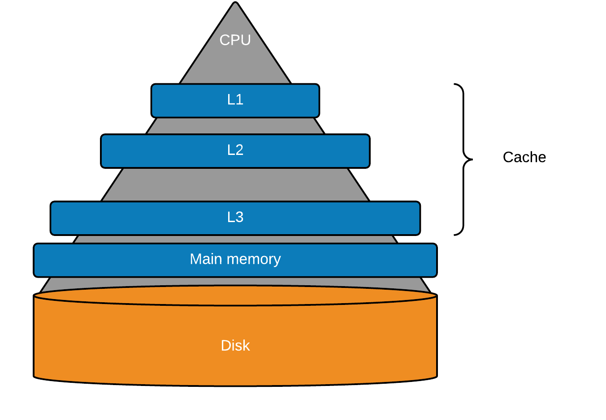

# Lecture Notes - 3/30/2016

### Table of Contents

 1. [Multicore System Structure](#multicore-system-structure)
 2. [Central Processing Unit](#central-processing-unit)
 3. [Core](#core)
 4. [Multi Level Memory](#multi-level-memory)
 5. [Processor](#processor)
 6. [PCB (Printed Circuit Board)](#pcb)
 7. [Computer History](#computer-history)

### Multicore System Structure

Single Processing Computer:
 - ALU: Arithmetic Logic Unit
 - CU: Control Unit
 - Registers

**Multicore Computer**: Contemporary computers have _multiple processors_ that are referred to as multicore computers.

Multiple processors are placed on a single silicon chip.

Each processing unit consists of:
 - ALU
 - CU
 - Registers
 - Cache

This is referred to as the **core**.

### Central Processing Unit

In a single processor, the functionality of the CPU is to:
 - Fetch instructions.
 - Decoding instructions.
 - Executing instructions.

### Core

In a multicore system, the functionality of a core is **similar** to the CPU.

A core consists of:
 - ALU
 - CU
 - Registers
 -Cache

### Multi Level Memory

Otherwise known as a cache, multi level memory is faster, smaller, & more expensive per bit.

Cache comes in multiple levels (1, 2, 3)

Cache is placed between the main memory & CPU.

Whats the job of cache?

**Cache buffers the data from main memory**.

Also holds data which is likely to be accessed in the near future.

### PCB

**PCB (Printed Circuit Board)**: A flat, rigid board that interconnects chips and electronic components.

The **main** PCB is referred to as the system board, or the **motherboard**.

**L1-I$**: Level 1 instruction cache.

**L1-D$**: Level 1 data cache.

We split L1-I$ & L1-D$ to avoid structural hazards.

**Memory holds both data & instruction**

### Processor

**Definition**: A physical piece of silicon consisting of one or more cores. The processor is the computer component that fetches, interprets, & executes instructions.

### Computer History

Five generations of computers.

In each generation, we will see changes in terms of size, cost, power, reliability, & efficiency.

#### First Generation (1940 - 1956)

Vacuum Tubes 
 - Consumed a lot of energy & generated a lot of heat.
 - Very slow & expensive.
 - Took the entire room.
 - Machine language used.
 - Punch cards used as input.
 - Printout used as output.

Examples: ENIAC

#### Second Generation (1956 - 1964)

Transistors
 - Computers became faster, cheaper, smallers.
 - Originally programmed in Assembly.
 - Eventually moved to COBOL, FORTRAN, & the like.
 - Punch cards as input.
 - Print out as output.

#### Third Generations (1964 - 1971)

Integrated Circuit
 - Minaturized transistors placed on a single chip.
 - Keyboard used as an input.
 - Monitor used as an output.
 - Operating system.

Depending on the number of transistors:
 - SSI: Small scale ICs
 - MSI: Medium scale ICs
 - LSI: Large scale ICs

#### Fourth Generation (1971 - Present)

Microprocessor
 - Thousands of integrated circuits.
 - Now, computers could fit in the palm of your hands
 - Intel 4004 Chips: 1971
 - CPU, Memory, IO Components are placed on a single chip.
 - **1981**, IBM introduced the first home computer.
 - **1984**, Apple introduced the Macintosh
 - Development of mouse, handheld devices, GUI

#### Fifth Generation (Present & Future)

Artificial Intelligence & Virtual Reality
 - Voice Recognition.
 - Goal for this generation is to develop devices that respond to natural human language as an input and are capable of learning & self organization.
 - Improving performance & use of parallel processing.

 

